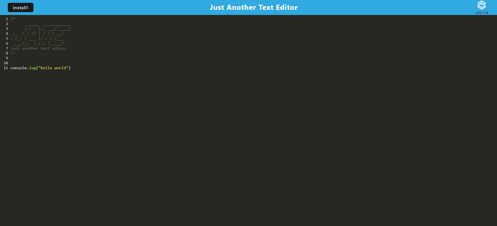
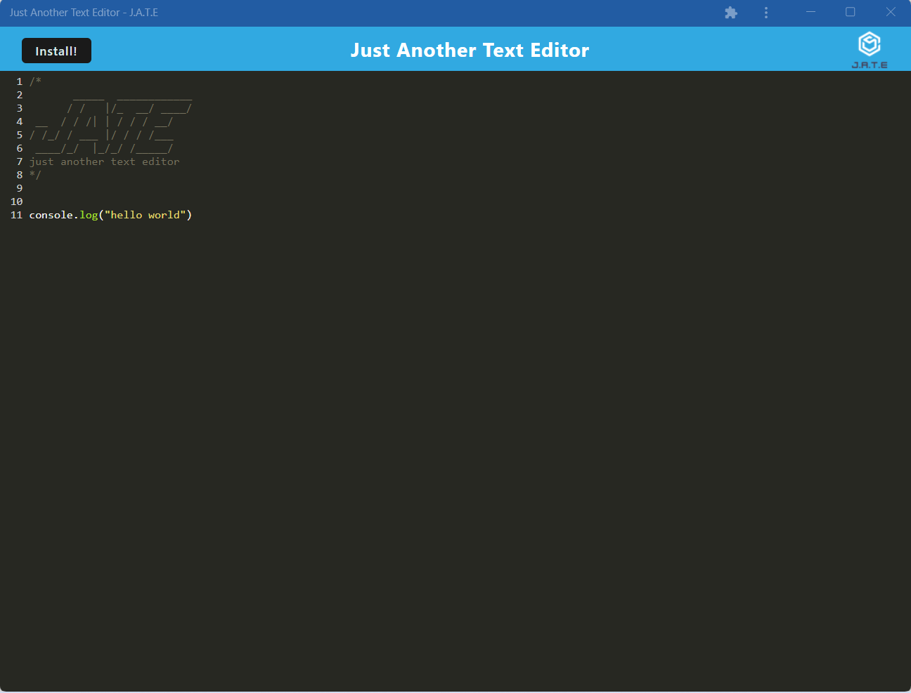

# Just Another Text Editor

## Link to deployed website: 

https://just-another-text-editor-assig.herokuapp.com/

## Screenshots of Website

## Description

For this assignment, I made a text editor that can be used in a browser or be installed to use without an internet connection. This application uses idb for the database. It also utilizes webpack. I found this assignment to be difficult to test. I had an issue that made it seem like my database did not work, and after troubleshooting for a while, I realized the issue was that my browser was caching all the data and not implementing my new code. After clearing the cache and rerunning it worked fine. In the future, I will clear my cache after implementing new code.

## Installation

To install the application, navigate to the website, then click the 'install' button. Follow the prompts to install.

## License

The MIT License was used for this assignment.